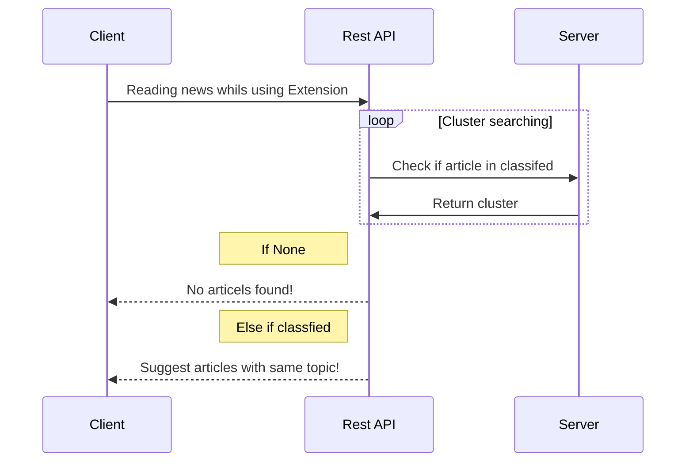

# All News Project

## Introduction

All news project is a service application which communicates
with browser extension that allows the user to read non-objective
news from several news channels. The extension
will identify which news article the user has read and suggests
more reading content about the same subject, In addition, the
application will give the user a summary on a specific subject
from a range of news websites,and in this way we give the user
the ability to read different-agenda news.

## Methods

When the user is reading a news article, the extension will
check if it is one of the news websites that is supported by the
system. if it is it will communicate with the cloud server rest API
that will check if there are any other news articles on the same
subject, then the extension will notify the user and suggest
that he also reads from other websites and offers more services
like a non-objective summary of the article that is a combination
of all the news articles that have the same article in a
different agenda.
The main core of the All News project is the server which is
based on Linux & Docker that manages and runs a couple of
different service components that each have a different part of the main goal.

## System architecture

## Client-Server sequence overview

## Using the Extension

- [Installation](https://github.com/all-news-project/extension/wiki/Installation)
- [How to use the extension](https://github.com/all-news-project/extension/wiki/How-to-use-the-extension)
- [User interface overview](https://all-news-project.github.io/ui/)
